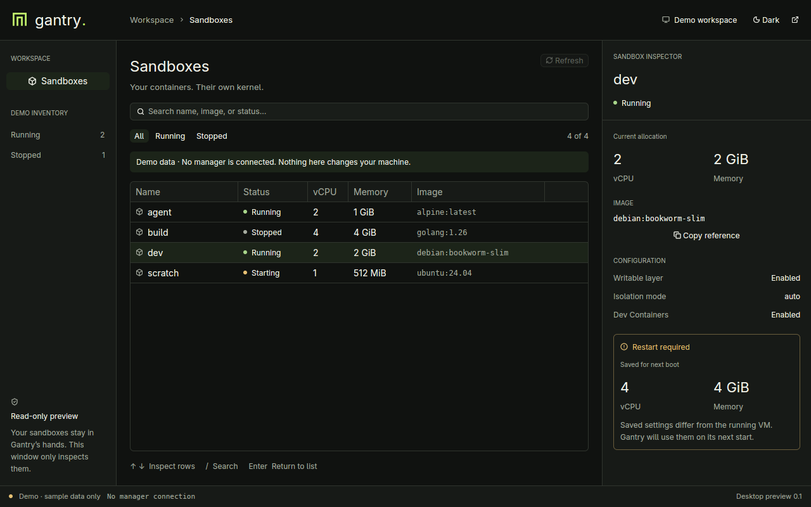

# Gantry Desktop — first preview

A native Rust / [GPUI Kit](https://github.com/longbridge/gpui-kit) frontend for
Gantry. This first slice is **read-only**: it inspects a local manager without
starting a daemon, changing configuration, or owning VM processes. Closing the
window does not affect your sandboxes. The Go CLI and TUI are unchanged.



## Run

Install a current stable Rust toolchain. The first build downloads and compiles
GPUI and its platform dependencies; subsequent builds are much faster. Commands
below run from the Gantry repository root.

Preview without a manager or virtualization access:

```sh
cargo run --locked --manifest-path desktop/Cargo.toml -- --demo --theme dark
```

Inspect real local sandboxes:

```sh
# In a separate terminal; omit this if your manager is already running.
gantry serve

# From this checkout:
cargo run --locked --manifest-path desktop/Cargo.toml
```

The default socket is `~/.gantry/manager.sock`. Selection precedence matches the
manager: `--socket PATH`, then `GANTRY_MANAGER_SOCKET`, then a socket beside
`GANTRY_HOME` (the sandbox directory), then the default. Custom sockets must live
in a private directory. For example:

```sh
cargo run --locked --manifest-path desktop/Cargo.toml -- \
  --socket "$HOME/.gantry/manager.sock" --theme light
```

`--theme system|dark|light` selects the initial appearance. The header control
cycles through all three; system mode follows appearance changes. Theme choice
and panel sizes are currently session-only. `--help` works without a display.

### Platform requirements

- **Linux:** a graphical Wayland or X11 session, a working GPU/Vulkan driver,
  a C/C++ toolchain, and the development packages for GPUI's native dependencies
  (including Wayland/X11, xkbcommon, fontconfig, and OpenSSL). See the upstream
  [platform bootstrap script](https://github.com/longbridge/gpui-kit/blob/main/script/bootstrap)
  for distribution-specific requirements. Do not run the application as root.
- **macOS:** Rust and Xcode command-line tools. Local Unix-socket support is
  included, but this preview has not been validated on macOS.
- **Windows:** local transport is not implemented in this preview. `--demo` is
  available for development, subject to GPUI's Windows build requirements;
  Windows builds have not been validated.

This checkout was built with Rust 1.98.1 and visually checked on Linux/Wayland,
including both themes, the minimum window size, and reconnection to an isolated
Go manager. OS accessibility, IME, HiDPI, and other platforms still need native
validation. There are no desktop installers or app bundles yet.

## Included

- Gantry branding, semantic light/dark themes, and bundled icons.
- Virtualized sandbox table with resizable columns and status filters.
- Case-insensitive search across name, image reference, and state.
- Resizable, scrollable inspector; active allocation is distinct from saved
  next-boot settings, with a restart-required notice when appropriate.
- Loading, empty, no-match, and unavailable states; automatic reconnection.
- Explicit `--demo` data, never used as a fallback for a failed connection.

Keyboard shortcuts:

| Shortcut | Action |
| --- | --- |
| Ctrl/⌘ F | Focus search |
| `/` while in the table | Focus search |
| Enter while searching | Focus the inventory |
| ↑ / ↓ in the table | Select a sandbox and update the inspector |
| Escape in search | Clear the query |
| Ctrl/⌘ 1 | Focus the inventory |
| Ctrl/⌘ R | Refresh |
| Ctrl/⌘ Q | Quit the desktop only |

## Integration boundary

`src/api.rs` issues only `GET /v1/health` and `GET /v1/sandboxes`, using the
[manager wire contract](../api/managerapi/openapi.yaml). All HTTP work runs on
GPUI's background executor. Requests are deadline- and size-bounded; proxies and
redirects are disabled. There is no TCP fallback, remote-profile discovery,
credential handling, CLI subprocess execution, or direct sandbox-state access.

For this slice, inventory is polled every three seconds with at most one refresh
in flight. This also catches changes made by the CLI. Failed refreshes clear
rows rather than displaying stale running state as current. Search/filter state
and selection by sandbox name survive successful refreshes.

SSE invalidation, remote HTTPS managers, lifecycle actions, image management,
terminal integration, and persistent preferences are follow-up work. Policy and
VM lifecycle decisions remain in Go.

## Develop and test

```sh
cargo fmt --manifest-path desktop/Cargo.toml -- --check

# Fast transport/model/options tests; no GPUI or graphics dependencies.
cargo test --locked --manifest-path desktop/Cargo.toml --no-default-features --lib

# Also render test windows and exercise real input, table, filter, and theme events.
cargo test --locked --manifest-path desktop/Cargo.toml --features ui-tests

cargo clippy --locked --manifest-path desktop/Cargo.toml \
  --all-targets --all-features -- -D warnings
```

The transport tests use disposable Unix sockets, not your real manager. GPUI
interaction tests use test windows and do not need a graphical session; they
still require GPUI's build dependencies. They check interaction and layout, not
native rendering or screen-reader conformance.

`Cargo.lock` is checked in, and the `gpui-kit` facade is pinned to keep the GPUI,
component, and asset versions aligned. `src/inventory.rs` and `src/options.rs`
are UI-independent; `app.rs` owns subscriptions/tasks, and `views.rs` renders
the retained state. The optional Rust build is separate from Gantry's Go build.
