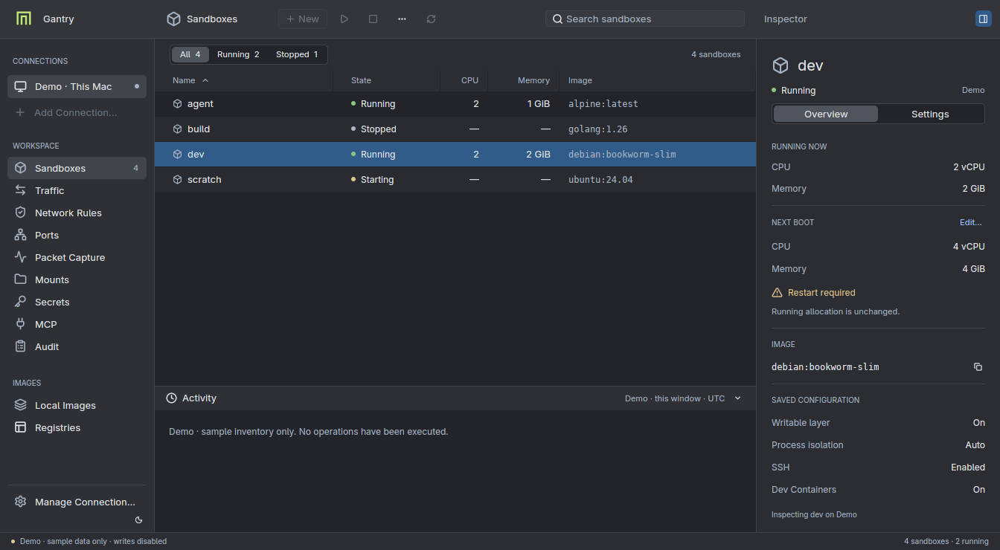

# Gantry Desktop — native preview

A native Rust / [GPUI Kit](https://github.com/longbridge/gpui-kit) frontend for
Gantry. Native dashboard screens and explicit read/write controls use the same
HTTP/JSON manager API over a local Unix socket or remote HTTPS. Local mode starts
its manager on demand; closing the window does not stop the manager or any sandbox.

This is a **working preview**, not yet complete TUI parity: it selects one host
at a time. Organization-login/catalog flows, SSE updates, and persistent
preferences remain follow-up work. Demo mode never permits writes.



## Workspace design

The [approved design study](design/desktop-workspace.png) is the styling reference:
neutral graphite surfaces, blue row selection, restrained Gantry branding, a
52px unified toolbar, a 208px source sidebar, and a resizable 328px inspector.
Light and system appearance use the same layout.

- Connections select the whole workspace. Unselected profile dots mean **not
  checked**, not online or offline. Profile management stays client-local.
- Right-click a sandbox (or use **…**) for actions on that exact row/source.
  Menus recheck the connection and sandbox state before opening a write form.
- **Edit…** / **⌘ I** opens saved settings in the inspector. Save and Cancel
  retain the original sandbox and verified source, even across refreshes.
- Create and Settings have CPU/memory sliders with exact numeric entry beside
  them (1 vCPU / 128 MiB steps). Slider bounds use the selected manager's limits;
  unknown limits use a convenience range, with Go still validating every write.
  Existing values are never silently clamped when opening an editor.
- **Browse…** opens the native file/folder chooser for a local manager's kernel
  and shared folders, and for client-local CA certificates. Remote-manager paths
  and guest paths remain text fields: a local picker cannot browse those filesystems.
  Selection only updates the draft; Save/Confirm is still explicit. Cancel keeps
  the previous path, and late results cannot modify a replacement form or host.
  If the platform chooser is unavailable, paths can still be entered directly.
- The CPU/Memory table columns describe running allocation only. Stopped VMs
  show dashes; their saved allocation is in **Next Boot**.
- Activity contains actual submissions, progress, and outcomes from this window,
  bounded to 100 entries, with UTC timestamps. It is not persisted and is not a
  replacement for the manager-wide Audit screen. Request bodies and secret input
  values are not recorded. Writes stay disabled until a post-operation refresh completes.
- The **Gantry** titlebar menu exposes Overview, connection management, pane
  toggles, appearance, and help. macOS also gets native application menus and
  real window controls; other platforms use their own window decorations.

The screenshot is a real Linux/Wayland render, not the SVG mockup. macOS native
window/menu behavior still needs on-device review; macOS controls are not drawn
as imitations on Linux.

## Run locally — no separate serve command

Install a current stable Rust toolchain and an up-to-date Gantry CLI supporting
`gantry serve --ensure` (release builds of the desktop can install the matching
CLI for you; see below). Commands below run from the repository root.

**Upgrading:** rebuild both the desktop and Go CLI, and restart any already-running
manager. Writes require the manager's `dashboard-control-v1` health capability,
checked again immediately before each action. Older managers remain read-only;
the desktop will never replace a running manager automatically. For managed
servers, preserve the original listener and policy-feed configuration when
restarting. Do not kill all Gantry processes: sandbox daemons are separate.

```sh
cargo run --locked --manifest-path desktop/Cargo.toml
```

The desktop first tries `~/.gantry/manager.sock`. If it is absent, it invokes
Gantry's bounded, single-instance startup command, then connects to the same
socket. It does not read sandbox state files or speak the per-sandbox `ctl.sock`
protocol. All inventory and inspection still go through `/v1`.

For a source checkout, build the Go binary and select it explicitly:

```sh
./scripts/build.sh
# Linux:
cargo run --locked --manifest-path desktop/Cargo.toml -- --gantry ./artifacts/gantry
# macOS (the build script also applies Hypervisor entitlements):
cargo run --locked --manifest-path desktop/Cargo.toml -- \
  --gantry ./artifacts/gantry-darwin-arm64
```

Without `--gantry`, the launcher looks beside the desktop executable, then in
absolute `PATH` entries, then at the desktop-managed `~/.gantry/bin/gantry`
(under the parent of `GANTRY_HOME` when that is set). It never invokes a shell
or builds the Go executable automatically.

### Installing the matching CLI from the desktop

If automatic local startup finds no Gantry CLI anywhere, the Sandboxes screen
says so and, in tagged release builds on Linux and Apple silicon macOS, offers
**Install Gantry CLI vX.Y.Z**. Nothing is downloaded until you click it. Then
the desktop:

- fetches `gantry-<os>-<arch>` and its `.sha256` sidecar from the GitHub
  release with the **same tag as the desktop**, so the CLI and desktop always
  match. HTTPS uses the system trust store, and only redirects to
  `github.com` / `*.githubusercontent.com` are followed. `HTTPS_PROXY` is
  honored, as it is for the CLI's own downloads;
- writes to an exclusively created, owner-only (`0700`) staging file in the
  private `~/.gantry/bin` directory, and refuses to use a Gantry root that
  other users could write to;
- checks the SHA-256, the executable format and CPU architecture, and on macOS
  `codesign --verify --strict` plus the Hypervisor entitlement, as
  `gantry update` does. A quarantine attribute is cleared only after all of
  these checks pass;
- atomically renames the verified file to `~/.gantry/bin/gantry`, then makes
  one normal startup attempt.

Any failure leaves nothing installed. A CLI you install yourself (beside the
desktop or on `PATH`) always takes precedence over the managed copy. If you
install one while the desktop is waiting, the next poll notices it and makes
one startup attempt. `~/.gantry/bin/gantry update` updates the managed copy in
place. Development builds are not stamped with a release, so they never offer
a download; use `--gantry` or `PATH` instead.

### Local startup rules

- Automatic startup applies only to the **default local** target. `GANTRY_HOME`
  selects the same sandbox state tree as the CLI.
- `--socket PATH` and `GANTRY_MANAGER_SOCKET` are **connect-only**, even when
  their path happens to equal the default. `--no-start` also disables startup.
- Only missing/refused sockets permit startup. Unsafe permissions, symlinks,
  incompatible protocols, authentication errors, and unhealthy existing
  managers are reported rather than replaced.
- Go serializes launchers, uses the existing manager-state ownership lock, and
  waits for a compatible health response. A TLS-only manager holding that
  state is not displaced. Saved policy-feed state requires an explicit
  `gantry serve` command with the correct governance configuration.
- The launched manager is same-user and Unix-only, detached from the terminal.
  Its diagnostics go to the private `manager.log` beside the socket. It remains
  running independently of the GUI; no sandbox is started by this operation.
- Automatic launch is attempted once per window. Polling continues to reconnect,
  but does not repeatedly spawn failing helpers. **Refresh** explicitly retries
  local startup. The only automatic exception: when the earlier attempt found no
  CLI at all, a CLI that appears later gets one attempt.

Connect to a separately managed socket:

```sh
cargo run --locked --manifest-path desktop/Cargo.toml -- --socket /private/path/manager.sock
```

The socket must be private, owned by your account, and in a private directory.
It must serve the manager's HTTP API; a sandbox's `ctl.sock` is a different,
internal protocol and cannot be substituted.

## Remote managers — the same protocol over HTTPS

Use the existing Gantry remote-profile workflow:

```sh
gantry remote add team https://gantry.example.com:8443 --ca manager-ca.pem
gantry remote test team
cargo run --locked --manifest-path desktop/Cargo.toml -- --remote team
```

The CLI prompts for the manager token without echo; for automation, use its
`--token-file` or `--token-stdin` options. The desktop never accepts bearer values
on its command line. It reads the credential-free `remotes.json` and the
separate protected token file under the same Gantry configuration root.

TLS always checks the certificate chain, hostname, validity, and handshake
signatures. A profile's optional fingerprint **additionally** pins the leaf
certificate during the handshake, before sending authorization. Redirects,
plaintext remote URLs, credential-bearing URLs, and proxy-environment routing
are refused. Remote failures never launch or select a local manager.

Profiles and tokens are reloaded on refresh, under the CLI's shared profile-store
lock, so replacing a profile cannot pair its previous URL with a new token.
Revocation, token rotation, and CA changes do not require restarting the GUI.
The selected host remains visible in the header and footer, including offline.
`GANTRY_REMOTE` is not an implicit desktop selector; choose `--remote` explicitly.

## Organization administration

A remote profile can point at an organization's
[policy service](../docs/gantry/organization-policy.md#run-a-policy-service)
instead of a sandbox manager. Register it the same way:

```sh
gantry remote add acme https://policy.acme.dev:8443 --ca ca.pem --token-stdin
```

When its health reports `policy-service-admin-v1`, the sidebar swaps the
workspace pages for the organization's:

- **Hosts:** every enrolled host manager, grouped by ring, with the generation
  it last reported. Stalled, rejected, mismatched and silent hosts are called
  out, with what each status means.
- **Policy:** the draft of the next generation, one profile at a time.
  - Network rules, DNS names, mount, MCP and credential rules are edited in
    place, and changes since the base generation are marked.
  - The **Changes** segment reviews each change as loosening or tightening
    access.
  - **Sign & Publish…** saves the draft, and the service validates it. The
    **Gantry CLI on this machine** then signs it (`gantry policy sign
    -signing-key`). The desktop checks the key matches the one every host
    pins, and only then uploads the bundle.
- **Rollouts:** the newest generation ring by ring, each host's offered and
  acknowledged times, **Promote to <ring>…**, and **Roll back…**.
- **History:** every generation, what it changed, and how many hosts run it.
  **Republish** rolls back by serving an old signed bundle under a new number.
- **Enrollment:** what hosts pin, and the certificates issued so far.
  - **Enroll host…** takes the `host.csr` from `gantry policy feed-request`
    and saves the host's `feed.json` and certificates to a new folder.
  - **Revoke…** makes the feed refuse a host.

These screens show only what hosts report on their own polls. Every write
goes to the policy service, which validates it again. The signing key is never
sent anywhere.

## Demo and appearance

Preview without a manager, CLI, or virtualization access:

```sh
cargo run --locked --manifest-path desktop/Cargo.toml -- --demo --theme dark
```

Demo data is explicitly labeled and never used as a failure fallback.
**Demo · acme** in the sidebar opens a sample organization, also read-only.
`--theme system|dark|light` selects the initial appearance; the header control
cycles through all three. Theme and panel sizes are session-only. `--help` works
without a display.

## Included

- Gantry branding, semantic light/dark themes, and bundled icons. The app icon
  in the Dock, taskbar and window switcher is `assets/app-icon.svg`; after
  editing it, run `assets/render-app-icon.sh` to refresh the PNG and ICO the
  executable embeds.
- Overview, Sandboxes, Traffic, Rules, Ports, Packets, Mounts, Secrets, MCP,
  Audit, Images, and Remotes screens, with retained per-page search and selection.
- Organization administration of a policy service: Hosts, Policy (draft,
  review, sign and publish), Rollouts, History, and Enrollment.
- Virtualized tables, resource inspection, and source-bound action dialogs.
- Sandbox create, saved-settings edit, start, stop, and confirmed deletion.
- Network rules/policy, port publishing, mounts, live secrets, MCP configuration,
  image pulls/pruning, registry login, and opt-in bounded packet capture.
- Client-local remote-profile add/remove through the Go CLI, and explicit host
  switching. Profile credentials use stdin, never process arguments.
- Pending actions, operation progress, and sanitized errors. No automatic replay
  after a write timeout; refresh the selected manager before retrying.
- Masked, non-copyable secret inputs; forms are dropped after submission/cancel.
  Replaced remote URLs, CAs, or pins invalidate an open action.
- Resizable, scrollable inspector separating active allocation from saved
  next-boot settings, including restart-required notices.
- Loading, empty, no-match, and unavailable states; automatic reconnection.
- An integrated terminal per sandbox: double-click a running sandbox (or choose
  **Open Terminal** from its **…** menu) for a shell in its Terminal tab.

### Integrated terminal

The terminal runs the Gantry CLI in a local pseudo-terminal, as the TUI's open
action does: `gantry exec NAME` for the local manager's sandboxes, and
`gantry ssh NAME -remote PROFILE` through a remote manager, which needs SSH
enabled in the sandbox and uses this desktop's profile store. Keystrokes,
paste, and window resizes go to the shell; nothing is logged or kept after the
tab is closed. Full-screen programs (top, vim, less) work, and the scrollback
holds 10,000 lines.

Inside the terminal, the keys a shell needs are the shell's: Ctrl+C interrupts,
Escape and Tab reach the program, and on Linux and Windows the Ctrl shortcuts in
the table below stay with the shell (Ctrl+R is reverse search). Copy and paste
are ⌘C / ⌘V on macOS and Ctrl+Shift+C / Ctrl+Shift+V elsewhere; drag to select,
double-click a word, triple-click a line. When the shell exits, Enter starts a
new one. Resizing follows the pane with a CLI and sandbox from this release;
older ones keep the size a session started with. Demo mode has no shell.

| Shortcut | Action |
| --- | --- |
| Ctrl/⌘ F, or `/` in the table | Focus search |
| Enter while searching | Focus the inventory |
| ↑ / ↓ in the table | Select a sandbox and update its inspector |
| Escape in search / a form | Clear the query / cancel the form |
| Ctrl/⌘ 1 | Open Sandboxes and focus the inventory |
| Ctrl/⌘ N | New sandbox |
| Ctrl/⌘ I | Edit the selected sandbox's saved settings |
| Ctrl/⌘ Shift I | Toggle the inspector |
| Ctrl/⌘ J | Toggle activity |
| Ctrl/⌘ R | Refresh / retry the selected connection |
| Ctrl/⌘ Q | Quit the desktop only |

## Platform requirements

- **Linux:** a Wayland or X11 graphical session, working GPU/Vulkan driver,
  C/C++ toolchain, and GPUI's native development dependencies. See the upstream
  [bootstrap script](https://github.com/longbridge/gpui-kit/blob/main/script/bootstrap)
  for distribution-specific packages. Do not run as root.
- **macOS:** Rust and Xcode command-line tools. Unix sockets, detached startup,
  and protected remote profiles are implemented but have not been tested on macOS.
- **Windows:** this preview supports UI development with `--demo` only. Local
  connection/startup and protected remote-profile loading fail closed until
  Windows transport, ACL, and profile-lock support is implemented.

Rust 1.98.1 and Linux/Wayland have been used for validation. OS accessibility,
IME, HiDPI, and other platforms still need native review. There are no installers
or app bundles yet. The first Rust build downloads and compiles GPUI dependencies.

## Architecture and tests

`src/api.rs` is one typed manager client over both transports. `commands.rs`
implements typed write intents and operation polling; `connector.rs` owns
startup and verifies that action targets have not changed. `launcher.rs` invokes
`gantry serve --ensure`; `bootstrap.rs` installs the matching CLI on request;
`local_profiles.rs` uses only the CLI's client-local profile workflow. Business operations never use shell commands or sandbox files.

`dashboard_wire.rs` and the dashboard sections of the
[OpenAPI contract](../api/managerapi/openapi.yaml) are generated from the same
Go DTOs used by the TUI. Go retains lifecycle, policy, and validation ownership.
The manager rejects ambiguous action payloads before selecting a sandbox lock,
and rechecks ordinal rule selections before removing them.

All file, HTTP, and launcher work stays off the GPUI foreground thread. HTTP
requests, file/response sizes, launcher output, and readiness waits are bounded.
Inventory polls every three seconds with one refresh in flight; failures
clear stale rows. Selection by name, search, and filters survive successful
refreshes. Profiles and tokens are reloaded before actions; no remote failure
can trigger a local write or startup. Packet payloads are memory-only and explicit
capture-stop clears the manager's retained recorder data.

```sh
cargo fmt --manifest-path desktop/Cargo.toml -- --check

# Protocol, TLS, profile security, launcher, and model tests; no GPUI build.
cargo test --locked --manifest-path desktop/Cargo.toml --no-default-features

# Also exercise real GPUI input, table, filter, theme, and layout behavior.
cargo test --locked --manifest-path desktop/Cargo.toml --features ui-tests
cargo clippy --locked --manifest-path desktop/Cargo.toml \
  --all-targets --all-features -- -D warnings

# Canonical DTO/schema drift check (omit -check to regenerate).
go run ./internal/dashboard/api/generate -check

# Go launcher, control-plane, and concurrency tests.
go test -race ./internal/sandbox/manager ./internal/sandbox/dashboardsvc
```

Tests use disposable sockets, TLS certificates, profiles, and manager state—not
your installed manager or sandboxes. TLS tests assert that an invalid chain,
hostname, expiry, or pin prevents any HTTP request from carrying the bearer.
GPUI tests use test windows, not a graphical session. `Cargo.lock` and the
`gpui-kit` facade are pinned; the Rust build remains separate from Gantry's Go build.
