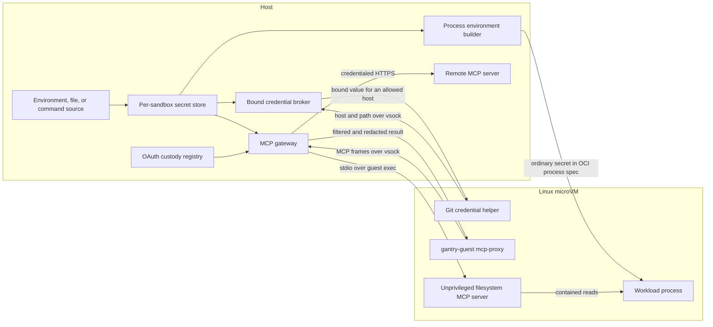

# Architecture

This page explains how Gantry turns an OCI image and a small set of host
capabilities into a running microVM sandbox. For the security properties and
limitations of these boundaries, see [Security](security.md).

## System overview

One named sandbox has one trusted supervisor and one Linux microVM. In the
default isolation mode, separate workers own the hypervisor/device model and
the userspace network data plane where the host supports the required
controls. The supervisor uses one process-neutral launch harness for every
worker role.

```text
                              host

  gantry CLI / TUI / manager API
                  │
                  │ same-user local control
                  ▼
  ┌──────────────────────────────────────────────────────────────┐
  │ sandbox supervisor                                           │
  │ lifecycle • config • secrets • OAuth • MCP capability brokers│
  │ guest RPC bridge • share roots • host ports                  │
  │                                                              │
  │ shared worker launch/supervision                             │
  │ exact role env + fd/handle table • nonce binding             │
  │ namespace/Job confinement • diagnostics • reap/cleanup       │
  └────────────┬────────────────────┬────────────────────────────┘
               │ authenticated      │ authenticated       authenticated
               │ capability channels│ frame/control       capability relays
               ▼                    ▼                     │
  ┌──────────────────────┐   ┌──────────────────────┐     ▼
  │ VMM worker           │   │ network worker       │   ┌──────────────────────┐
  │ hypervisor • RAM     │   │ policy • NAT • DNS   │   │ MCP worker (enabled) │
  │ virtio devices       │   │ forwards • traffic   │   │ MCP parsing • policy │
  └──────────┬───────────┘   └──────────┬───────────┘   └──────────────────────┘
             │ virtio                   │ host sockets
             ▼                          ▼
  ┌──────────────────────────────┐   public network / proxy
  │ Linux microVM                │
  │ vminitd                      │
  │   └─ crun or runsc           │
  │       └─ OCI workload        │
  └──────────────────────────────┘
```

The launch harness is trusted supervisor code, not another process. VMM and
network workers use it for every sandbox where their split topology is
available. MCP-enabled sandboxes always use the same harness for a separate
MCP worker; there is no production in-supervisor MCP parsing fallback.

VMM and network roles may fall back when their split is unavailable in `auto`;
`required` fails instead. MCP remains a separate process whenever MCP is
enabled, including in `off`, where its OS-confinement report is explicitly
disabled. Effective, verified state is written to `isolation.json`; configured
mode alone is not treated as proof.

## Host components

### CLI and dashboard

The `gantry` binary contains the command-line client, terminal dashboard,
manager service, supervisor, network stack, and VMM. Hidden worker roles
re-execute the same binary with inherited, authenticated channels.

The ordinary command paths are:

- `start` resolves configuration and launches a persistent supervisor.
- `exec <name>` connects to that supervisor's local session broker.
- one-shot `exec` creates a randomly named transient sandbox, runs one
  session, and deletes it.
- `tui` uses the same local lifecycle and control surfaces as the CLI.
- `serve` provides a structured local HTTP API and delegates lifecycle work
  to the same implementation.

### Sandbox supervisor

The supervisor is the trusted host control plane for one sandbox. It owns:

- durable `sandbox.json` configuration and the sandbox lifetime lock;
- the host secret store, OAuth custody registry, and MCP capability brokers;
- local control listeners and session multiplexing;
- opened boot assets and writable disks before capabilities are delegated;
- host share roots and share admission policy;
- port and policy mutations, traffic snapshots, and graceful shutdown;
- the persistent guest ttrpc connection over virtio-vsock.

The supervisor runs with the privileges of the user who launched Gantry. It
does not run as a system daemon.

### Worker launch substrate

Split roles use one process-neutral launch harness in
`internal/sandbox/worker`. It re-executes the current binary with an explicit
role and empty-by-default environment, builds the exact Unix descriptor or
Windows handle table, supports nonce-binding independent data channels to the
launch handshake, routes standard streams through a supervisor-owned bounded
log, applies the
requested namespace or Job boundary, and owns process reaping and containment
cleanup. Each role retains its own bootstrap schema, inherited-capability
validation, RPC protocol, syscall profile, readiness checks, and decision
about whether worker failure terminates the sandbox. VMM or network worker
failure is fatal; MCP worker failure withdraws MCP while the VM remains usable.

The role argument is not authority. Only inherited channels and files, plus
the per-launch nonce that correlates them, grant capabilities to the child.

### VMM worker

The VMM worker normally owns guest RAM, the platform hypervisor, virtual CPUs,
and the virtio device model. On Windows, WHPX rejects AppContainer tokens, so a
narrow Job-confined `_whpx-worker` owns only the partition/vCPUs while the
zero-capability AppContainer VMM worker retains boot and device emulation. They
map one anonymous RAM section and exchange validated exits through fixed
shared-memory mailboxes/events; low-volume control uses authenticated pipes.
The broker receives no disks, share roots, guest console, or network handles.

The supervisor passes pre-opened files and authenticated channels, so a
confined worker does not need general host-path access. On Linux its Landlock
policy therefore allows no new path access. Shares remain
in the supervisor and cross a path-neutral broker or vhost relay, so live
share add/remove does not require changing the worker's Linux Landlock or
macOS Seatbelt profile.

The VMM uses:

| Host | Backend |
|---|---|
| Linux | KVM |
| Apple silicon macOS | Hypervisor.framework |
| Windows x86-64 | Windows Hypervisor Platform |

Gantry implements the VM and its virtio devices in Go; it does not wrap QEMU
or libkrun.

### Network worker

The network worker runs the userspace IPv4 stack, DNS gateway, egress policy,
host-to-guest forwarding, and traffic accounting. Frames leaving the VM cross
the policy point before they reach a host socket. DNS replies cross it on the
way back so the policy can maintain bounded, TTL-limited domain allowances.

The network worker necessarily retains restricted stream and datagram socket
creation authority. It does not receive secrets, writable disks, guest RAM,
or host share roots. Its Linux Landlock policy allows reads of only the exact
private resolver snapshots copied into its private root; it delegates no
filesystem subtree. Windows gives the role a fixed network-capability set in
an AppContainer inside a one-process Job, then verifies denial of undelegated
filesystem access and child execution before constructing the stack.

Windows AppContainer network isolation does not permit host loopback without a
privileged machine-wide exemption, which Gantry deliberately does not install.
`auto` therefore falls back to the in-supervisor stack when startup includes a
published port or a loopback-allowing policy; `required` rejects those options.
A live port publish or loopback-enabling policy mutation against an already
split Windows network worker is rejected explicitly.

An explicit `-gvproxy` selects an external backend instead. Live policy,
traffic inspection, proxy enforcement, and built-in port publishing require
the embedded stack.

### MCP worker

An MCP-enabled sandbox has one `_mcp-worker`. It owns guest MCP parsing,
JSON-RPC routing, tool policy, local stdio framing, and remote HTTP/TLS/SSE.
The supervisor relays opaque guest and upstream bytes over a bounded
multiplexer; it does not parse MCP payloads. On Windows, the supervisor keeps
the path-addressed AF_UNIX endpoint and relays it through a connected Winsock
pair transferred to the VMM worker. This avoids unreliable cross-process
AF_UNIX duplication without granting the VMM worker path or dial authority.

The worker can request only a configured server ID. The supervisor maps that
ID to a fixed guest helper, a validated and DNS-pinned remote dial, and the one
credential configured for that server. It never accepts a URL, address, argv,
path, secret name, or sandbox ID from the worker. Refresh tokens, complete
secret sources, share roots, and arbitrary guest execution remain outside the
worker.

On Linux the MCP profile adds a deny-all Landlock filesystem ruleset to the
private mount root, descriptor closure, namespace/task controls, and its
no-socket/no-exec seccomp allowlist. macOS applies a deny-default Seatbelt
profile. Windows uses a zero-capability AppContainer plus one-process,
kill-on-close Job and verifies fs-read, fs-write, net-dial, and exec denial.
Windows `required` uses the brokered WHPX VMM and, when networking is enabled,
the AppContainer network worker after their required properties are verified.
An intentionally offline `-net=false` topology omits virtio-net and still runs
the split VMM rather than falling back to the supervisor.

## Guest components

The guest boots a Gantry kernel and a small EROFS system root derived from
containerd/nerdbox. `vminitd` configures devices and the network, provides
mount, bundle, task, and stream services over ttrpc, and starts the selected
OCI runtime.

`crun` is the default runtime. `runsc` runs a gVisor sandbox inside the VM and
uses compatible guest assets.

For a persistent sandbox, Gantry keeps one long-lived base container to own
the assembled image, writable layer, and guest share mounts. Each `gantry exec
<name>` runs as PID 1 in a dedicated short-lived container whose rootfs is a
bind mount of that base root. This preserves shared filesystem state and
concurrent sessions, while giving every session an independent PID namespace
and task lifecycle. Normal exit or an explicit kill tears down the entire
session process tree, then deletes its task, rootfs bind, and bundle. The
supervisor multiplexes these sessions over the VM's single ttrpc dial-back
connection, while separate virtio-vsock streams carry their I/O.

## Boot flow

```text
start request
    │
    ├─ validate resources, paths, shares, policy, and proxy
    ├─ locate or download verified guest assets
    ├─ resolve OCI image for the guest architecture
    ├─ build/reuse digest-addressed EROFS
    ├─ create and pair a private ext4 writable layer
    ├─ write durable sandbox.json
    └─ launch supervisor
           │
           ├─ load secrets from the inherited stdin handshake
           ├─ start network and share services
           ├─ open kernel, rootfs, image, and writable disk
           ├─ start and confine workers
           ├─ boot virtual CPUs
           ├─ accept the guest ttrpc dial-back
           ├─ start the same-user ctl.sock broker
           └─ publish readiness
```

The parent `start` command returns only after both guest RPC and `ctl.sock` can
accept work. Boot inputs are opened before worker confinement, which prevents
a path from being exchanged between validation and use.

## Filesystems and persistence

The guest receives several block-backed filesystems:

- a read-only Gantry system root containing `vminitd` and guest tooling;
- a read-only flattened OCI image, or a native EROFS layer set;
- an optional private ext4 writable layer used as the overlay upper layer.

OCI image cache entries are immutable and shared between sandboxes by digest.
Writable ext4 layers are private and must not be shared by running VMs.

Host directories use a single multiplexed virtio-fs share hub. Each admitted
tag appears in the guest namespace and is bind-mounted into the container at
its selected path. The supervisor retains the host roots and applies
read-only and path-confinement policy. On Apple silicon macOS, the split VMM
uses shared guest RAM and vhost-style doorbells by default so host filesystem
latency never holds an HVF exit thread; set `GANTRY_VHOST_SHARES=0` only to
diagnose the framed-broker fallback. Linux keeps that fallback by default and
can opt into vhost shares with `GANTRY_VHOST_SHARES=1`. Neither path gives the
VMM worker host share roots.

There is no private checkout layer: host-share changes are changes to the
original host directory. Guest `syncfs` requests are handled by the share hub:
Unix syncs each pinned backing filesystem, while Windows flushes every live
writable share handle (closed handles are flushed by FUSE `FLUSH`).

On SMP guests, PID 1 spreads virtio interrupt affinity by device slot after
deferred CPU onlining completes. The HVF backend uses the same slot mapping to
wake the assigned vCPU (plus CPU 0 for compatibility with custom system roots),
rather than waking every vCPU for each filesystem completion.

A sandbox created or live-configured with `-devcontainers` uses an explicit
outer OCI profile for an inner Podman runtime in the same microVM. The profile
exposes only FUSE, TUN, a read-only cgroup2 view, shared root propagation, and
the namespace-administration capabilities needed by inner `crun`. Nested
cgroup management is disabled and no host container-engine socket is mounted.
New sessions observe live profile changes; existing sessions retain the OCI
configuration with which they started.

## Host capability bridges

Shares, secrets, OAuth, and MCP deliberately cross the VM boundary in narrow,
different ways. A share delegates access to a selected host directory. An
ordinary secret delegates a value to a guest process. A bound secret or MCP
credential instead stays in a host service and is released only through that
service's protocol.

### Host shares

The supervisor opens and validates each host root before admitting it to the
share hub. Guest requests name an admitted tag and a path relative to that
root; they do not carry arbitrary host paths. The backend applies read-only
policy before mutating host files and rejects traversal outside the root.

The guest mounts the multiplexed virtio-fs hub once, then bind-mounts admitted
tags into the workload container. Live add and remove mutate the hub manifest
rather than attaching another VM device. Persistent changes are serialized to
`sandbox.json` and replayed on resume.

### MCP and credential flow

The following diagram shows where values cross the host/guest boundary. Solid
credential arrows represent explicit release points; the remote MCP header
never travels through the guest.



The launcher passes secret source descriptions and memory-only values to the
new supervisor through a bounded inherited-stdin handshake. The supervisor
scrubs corresponding environment keys, and `sandbox.json` retains only names,
bindings, and source references.

Ordinary secrets are resolved into a process specification and therefore
become visible to that guest process. File and command sources are resolved at
use time and cached by TTL. A failed refresh invalidates the old cache entry;
the broker never falls back to a stale value.

A host-bound secret is excluded from guest environments. The git helper sends
a host/path request over its dedicated virtio-vsock service. The supervisor
checks the binding and current egress policy, resolves the source, and returns
the value for that operation. Removal changes the host store immediately, so
there is no durable guest copy to revoke.

The MCP endpoint is another per-sandbox host listener. The in-guest
`mcp-proxy` carries newline-delimited MCP frames over virtio-vsock to the
confined MCP worker through an opaque supervisor relay. For the built-in
filesystem server, the supervisor starts `gantry-guest mcp-serve` through
the existing guest exec channel, launches it as root only long enough to drop
to the configured non-root UID/GID, and connects its stdio to the MCP session.
The server uses an `os.Root` jail, while the gateway exposes only read and list
tools.

Remote MCP servers are reached from the host with streamable HTTP. The gateway
resolves a named secret or current custody token, injects the header after
validating the destination, and refuses credentialed redirects. Address
validation happens in the dial path: public HTTPS is required except for an
explicit loopback development endpoint; private, link-local, CGNAT, and cloud
metadata destinations are rejected.

Every remote uses a default-deny tool policy. The gateway rewrites upstream
request IDs, redacts injected and configured values from results and errors,
and audits names and decisions rather than payloads. Frames and responses are
limited to 1 MiB; one session permits 16 in-flight calls, one gateway permits
16 sessions, and idle sessions expire after five minutes.

The [MCP worker confinement design](mcp-worker-confinement.md) documents the
capability protocol, residual risks, platform enforcement, and remaining
in-guest filesystem hardening work.

### OAuth bridge and custody

The callback bridge recognizes supported guest loopback authorization URLs
and creates a short-lived listener on host loopback. It validates the expected
path and state, accepts one callback, and replays that callback to the guest
loopback service. Redirects returned by that service are restricted to
absolute paths on the bridge origin, so the guest cannot use the host browser
as an external or host-local request proxy. The bridge is separate from
general port publishing.

With custody enabled, the supervisor performs the provider-specific code
exchange. It writes the refresh token to `oauth-tokens.json` in the protected
sandbox state directory, while the guest provider file receives an access
token and a sentinel in place of the refresh token. The refresh loop updates
the host registry atomically and pushes replacement access tokens into the
guest. On resume, the supervisor restores that registry before restarting the
refresh loop.

## Network flow

```text
guest process
    │
    ▼
virtio-net
    │ Ethernet frames
    ▼
egress policy + traffic recorder
    │ allowed frames only
    ▼
userspace NAT / DNS / forwarder
    │
    ▼
host sockets → destination or upstream proxy
```

The default local-network wall is independent of an allow-by-default public
internet posture. Published ports travel in the opposite direction: a
specific host listener forwards to the fixed guest address and selected port.

## Local control and execution

Each persistent sandbox exposes `ctl.sock` inside its private state directory.
On Unix, the broker validates peer credentials; Windows uses a protected local
endpoint. A terminal session uses two channels:

1. A bounded JSON control channel carries the versioned exit event.
2. A data channel becomes a raw standard-input/output byte stream after its
   bounded JSON handshake.

Keeping the exit status out of the byte stream means guest output cannot forge
process state. The manager API uses the same broker with explicit timeout and
output-size bounds.

## On-disk state

The default layout is:

```text
<user-cache>/gantry/assets/<version>-<build-id>/
    └── verified release kernel, system root, and default image

~/.gantry/
├── credentials.json
├── images/
│   ├── index.json
│   ├── tmp/pull-*/            # private, removed after image construction
│   ├── sha256-<digest>.erofs
│   └── sha256-<digest>.json
├── rwlayers/
│   ├── <name>.ext4
│   └── <name>.ext4.image
└── sandboxes/<name>/
    ├── sandbox.json
    ├── oauth-tokens.json       # only when OAuth custody is used
    ├── isolation.json
    ├── network-traffic.json
    ├── console.log
    ├── daemon.log
    ├── worker-net.log
    ├── worker-vmm.log
    ├── worker-mcp.log          # when MCP is enabled
    ├── mcp-restart-required    # saved MCP config differs from the live worker
    └── runtime locks, sockets, and readiness files
```

Ordinary workload secret values do not appear in this layout. OAuth custody
is the deliberate exception: its refresh tokens persist in the private
`oauth-tokens.json` registry so stop/resume can preserve a login. Gantry uses
mode `0600` and a protected Windows DACL for that file.

A stop removes transient runtime sockets and processes but preserves
configuration and disk state. Delete also removes the named sandbox's
Gantry-managed default writable layer; a custom `-rwlayer` remains
caller-owned.
