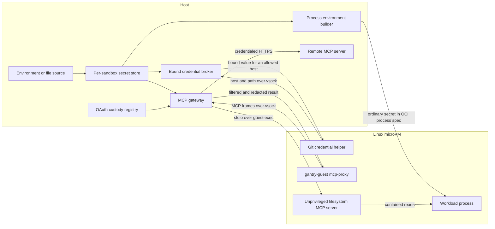

# Architecture

This page explains how Gantry turns an OCI image and a small set of host
capabilities into a running microVM sandbox. For the security properties and
limitations of these boundaries, see [Security](security.md).

## System overview

One named sandbox has one trusted supervisor and one Linux microVM. In the
default isolation mode, separate workers own the hypervisor/device model and
the userspace network data plane where the host supports the required
controls. The supervisor uses one process-neutral launch harness for every
worker role.

```text
                              host

  gantry CLI / TUI / manager API
                  │
                  │ same-user local control
                  ▼
  ┌──────────────────────────────────────────────────────────────┐
  │ sandbox supervisor                                           │
  │ lifecycle • config • secrets • OAuth • MCP capability brokers│
  │ guest RPC bridge • share roots • host ports                  │
  │                                                              │
  │ shared worker launch/supervision                             │
  │ exact role env + fd/handle table • nonce binding             │
  │ namespace/Job confinement • diagnostics • reap/cleanup       │
  └────────────┬────────────────────┬────────────────────────────┘
               │ authenticated      │ authenticated       authenticated
               │ capability channels│ frame/control       capability relays
               ▼                    ▼                     │
  ┌──────────────────────┐   ┌──────────────────────┐     ▼
  │ VMM worker           │   │ network worker       │   ┌──────────────────────┐
  │ hypervisor • RAM     │   │ policy • NAT • DNS   │   │ MCP worker (enabled) │
  │ virtio devices       │   │ forwards • traffic   │   │ MCP parsing • policy │
  └──────────┬───────────┘   └──────────┬───────────┘   └──────────────────────┘
             │ virtio                   │ host sockets
             ▼                          ▼
  ┌──────────────────────────────┐   public network / proxy
  │ Linux microVM                │
  │ vminitd                      │
  │   └─ crun or runsc           │
  │       ├─ OCI workload        │
  │       └─ OCI IDE (optional)  │
  └──────────────────────────────┘
```

The launch harness is trusted supervisor code, not another process. VMM and
network workers use it for every sandbox where their split topology is
available. MCP-enabled sandboxes always use the same harness for a separate
MCP worker; there is no production in-supervisor MCP parsing fallback.

VMM and network roles may fall back when their split is unavailable in `auto`;
`required` fails instead. MCP remains a separate process whenever MCP is
enabled, including in `off`, where its OS-confinement report is explicitly
disabled. Effective, verified state is written to `isolation.json`; configured
mode alone is not treated as proof.

## Host components

### CLI and dashboard

The `gantry` binary contains the command-line client, terminal dashboard,
manager service, supervisor, network stack, and VMM. Hidden worker roles
re-execute the same binary with inherited, authenticated channels.

The ordinary command paths are:

- `start` resolves configuration and launches a persistent supervisor.
- `exec <name>` connects to that supervisor's local session broker.
- one-shot `exec` creates a randomly named transient sandbox, runs one
  session, and deletes it.
- `tui` uses the same local lifecycle and control surfaces as the CLI, with
  separate source-scoped clients for remote rows.
- `serve` provides the HTTP/JSON manager API on a Unix socket by default, or
  on explicitly configured TLS listeners with bearer authentication. It
  delegates lifecycle work to the same implementation.

Create and resume use the typed `internal/sandbox/lifecycle` application
contract. CLI flags, HTTP JSON, and dashboard form inputs are converted into
launch options at their respective adapters. The shared service owns
configuration resolution, the launch lock, and readiness; it returns ordinary
Go errors and structured progress events. HTTP creation retains its explicit
read-only default and cached-image policy.

`internal/sandbox/inspection` supplies the shared readiness and configuration
read model. The daemon publishes its immutable boot settings before readiness,
allowing frontends to distinguish active resources from saved changes that
require restart. The create dialog owns its form state and emits control
geometry during rendering.

Dashboard shutdown cancels and joins its launch operations and background
subprocesses. Preparation checks cancellation between its existing bounded
stages; a launch cancelled before readiness reaps its uncommitted daemon.
After readiness the persistent sandbox owns its daemon independently of the
caller. Subprocess diagnostics retain a bounded tail.

### Sandbox supervisor

The supervisor is the trusted host control plane for one sandbox. It owns:

- durable `sandbox.json` configuration and the sandbox lifetime lock;
- the host secret store, OAuth custody registry, and MCP capability brokers;
- local control listeners and session multiplexing;
- opened boot assets and writable disks before capabilities are delegated;
- host share roots and share admission policy;
- port and policy mutations, traffic snapshots, and graceful shutdown;
- the persistent guest ttrpc connection over virtio-vsock.

The supervisor runs with the privileges of the user who launched Gantry. It
does not run as a system daemon.

### SSH gateway and guest helper

SSH is a host-side protocol gateway, not an `sshd` inside the microVM. On Unix
it listens on `ssh.sock` in the sandbox's private state directory and verifies
the connecting process's UID; Windows uses a protected local endpoint. No TCP
SSH listener is created. `gantry ssh` supplies OpenSSH with a `ProxyCommand`
and `KnownHostsCommand`; `gantry ssh setup` installs the equivalent managed
wildcard configuration using locked, atomic writes. One install-wide Ed25519
host key identifies Gantry's local gateways.

After the SSH handshake, the gateway maps each session, PTY, SFTP, or guest
loopback-forward request onto the supervisor's existing session broker. SSH
sessions execute `/run/gantry/bin/gantry-guest ssh-session` as the selected
OCI user. The gateway accepts no client credential because access to the
private local endpoint, including its same-user check, is the authentication
boundary. It rejects remote forwarding, agent forwarding, and non-loopback
forward targets.

`gantry-guest` also supports bound credentials, OAuth custody, and MCP. The
supervisor reads the size-bounded host asset, hashes it, installs it through a
temporary read-only share when possible, and falls back to the bounded exec
stream. It verifies the installed size and SHA-256 before marking the helper
usable; a failed attempt removes stale guest content and leaves helper-backed
features unavailable.

SSH helper delivery runs asynchronously once guest RPC and the local control
broker exist, so SSH and Dev Containers do not extend VM readiness. An SSH
session arriving during delivery waits for its result. MCP, bound credentials,
and OAuth custody remain part of the ready contract because their advertised
interfaces require the verified helper.

### Worker launch substrate

Split roles use one process-neutral launch harness in
`internal/sandbox/worker`. It re-executes the current binary with an explicit
role and empty-by-default environment, builds the exact Unix descriptor or
Windows handle table, supports nonce-binding independent data channels to the
launch handshake, routes standard streams through a supervisor-owned bounded
log, applies the
requested namespace or Job boundary, and owns process reaping and containment
cleanup. Each role retains its own bootstrap schema, inherited-capability
validation, RPC protocol, syscall profile, readiness checks, and decision
about whether worker failure terminates the sandbox. VMM or network worker
failure is fatal; MCP worker failure withdraws MCP while the VM remains usable.

The role argument is not authority. Only inherited channels and files, plus
the per-launch nonce that correlates them, grant capabilities to the child.

### VMM worker

The VMM worker normally owns guest RAM, the platform hypervisor, virtual CPUs,
and the virtio device model. On Windows, WHPX rejects AppContainer tokens, so a
narrow Job-confined `_whpx-worker` owns only the partition/vCPUs while the
zero-capability AppContainer VMM worker retains boot and device emulation. They
map one anonymous RAM section and exchange validated exits through fixed
shared-memory mailboxes/events; low-volume control uses authenticated pipes.
The broker receives no disks, share roots, guest console, or network handles.

The supervisor passes pre-opened files and authenticated channels, so a
confined worker does not need general host-path access. Workload and IDE
writable layers are independent ordered descriptors with separate virtio-blk
capacities; private supervisor locks retain lifetime ownership. On Unix, the
worker's process-wide file-size limit is set to the largest writable layer as
defense in depth. On Linux its Landlock policy therefore allows no new path
access. Shares remain in the supervisor and cross a path-neutral broker or
vhost relay, so live share add/remove does not require changing the worker's
Linux Landlock or macOS Seatbelt profile.

The VMM uses:

| Host | Backend |
|---|---|
| Linux | KVM |
| Apple silicon macOS | Hypervisor.framework |
| Windows x86-64 | Windows Hypervisor Platform |

Gantry implements the VM and its virtio devices in Go; it does not wrap QEMU
or libkrun.

### Network worker

The network worker runs the userspace IPv4 stack, DNS gateway, egress policy,
host-to-guest forwarding, and traffic accounting. Frames leaving the VM cross
the policy point before they reach a host socket. DNS replies cross it on the
way back so the policy can maintain bounded, TTL-limited domain allowances.

The network worker necessarily retains restricted stream and datagram socket
creation authority. It does not receive secrets, writable disks, guest RAM,
or host share roots. Its Linux Landlock policy allows reads of only the exact
private resolver snapshots copied into its private root; it delegates no
filesystem subtree. Windows gives the role a fixed network-capability set in
an AppContainer inside a one-process Job, then verifies denial of undelegated
filesystem access and child execution before constructing the stack.

Windows AppContainer network isolation does not permit host loopback without a
privileged machine-wide exemption, which Gantry deliberately does not install.
`auto` therefore falls back to the in-supervisor stack when startup includes a
published port or a loopback-allowing policy; `required` rejects those options.
A live port publish or loopback-enabling policy mutation against an already
split Windows network worker is rejected explicitly.

The legacy external `-gvproxy` backend is disabled. It launched a configurable
host executable outside the worker boundary; the embedded stack is the only
network backend in the hardened configuration.

### MCP worker

An MCP-enabled sandbox has one `_mcp-worker`. It owns guest MCP parsing,
JSON-RPC routing, tool policy, local stdio framing, and remote HTTP/TLS/SSE.
The supervisor relays opaque guest and upstream bytes over a bounded
multiplexer; it does not parse MCP payloads. On Windows, the supervisor keeps
the path-addressed AF_UNIX endpoint and relays it through a connected Winsock
pair transferred to the VMM worker. This avoids unreliable cross-process
AF_UNIX duplication without granting the VMM worker path or dial authority.

The worker can request only a configured server ID. The supervisor maps that
ID to a fixed guest helper, a validated and DNS-pinned remote dial, and the one
credential configured for that server. It never accepts a URL, address, argv,
path, secret name, or sandbox ID from the worker. Refresh tokens, complete
secret sources, share roots, and arbitrary guest execution remain outside the
worker.

On Linux the MCP profile adds a deny-all Landlock filesystem ruleset to the
private mount root, descriptor closure, namespace/task controls, and its
no-socket/no-exec seccomp allowlist. macOS applies a deny-default Seatbelt
profile. Windows uses a zero-capability AppContainer plus one-process,
kill-on-close Job and verifies fs-read, fs-write, net-dial, and exec denial.
Windows `required` uses the brokered WHPX VMM and, when networking is enabled,
the AppContainer network worker after their required properties are verified.
An intentionally offline `-net=false` topology omits virtio-net and still runs
the split VMM rather than falling back to the supervisor.

## Guest components

The guest boots a Gantry kernel and a small EROFS system root derived from
containerd/nerdbox. `vminitd` configures devices and the network, provides
mount, bundle, task, and stream services over ttrpc, and starts the selected
OCI runtime.

`crun` is the default runtime. `runsc` runs a gVisor sandbox inside the VM and
uses compatible guest assets.

For a persistent sandbox, Gantry keeps a long-lived workload base container to
own the `-image` root, writable layer, and guest share mounts. Each `gantry exec
<name>` runs as PID 1 in a dedicated short-lived container whose rootfs is a
bind mount of that workload root.

With Dev Containers enabled, the same VM receives a second curated EROFS image
and writable layer. A separate long-lived IDE base container mounts those
devices; SSH sessions bind-mount the IDE root and receive the nested-runtime
OCI profile. The VS Code Dev Containers extension reads
`.devcontainer/devcontainer.json` and drives Podman through the curated
Docker-compatible CLI to build and start the inner container. The workload
root and IDE root are peer
`crun` containers—enabling the profile never replaces `-image` and does not
require Podman in the workload.

This preserves shared filesystem state and concurrent sessions while giving
every session an independent PID namespace and task lifecycle. Normal exit or
an explicit kill tears down the entire session process tree, then deletes its
task, rootfs bind, and bundle. The supervisor multiplexes both roots' sessions
over the VM's single ttrpc dial-back connection, while separate virtio-vsock
streams carry their I/O.

## Boot flow

```text
start request
    │
    ├─ validate resources, paths, shares, policy, and proxy
    ├─ locate or download verified guest assets
    ├─ resolve OCI image for the guest architecture
    ├─ build/reuse the workload EROFS
    ├─ optionally stage the curated IDE EROFS
    ├─ create and pair their private ext4 writable layers
    ├─ write durable sandbox.json
    └─ launch supervisor
           │
           ├─ load secrets from the inherited stdin handshake
           ├─ start network and share services
           ├─ open kernel, rootfs, image, and writable disk
           ├─ start and confine workers
           ├─ boot virtual CPUs
           ├─ accept the guest ttrpc dial-back
           ├─ start the same-user ctl.sock broker
           └─ publish readiness
```

The parent `start` command returns only after both guest RPC and `ctl.sock` can
accept work. Boot inputs are opened before worker confinement, which prevents
a path from being exchanged between validation and use.

## Filesystems and persistence

The guest receives several block-backed filesystems:

- a read-only Gantry system root containing `vminitd` and guest tooling;
- a read-only flattened OCI image, or a native EROFS layer set;
- an optional private ext4 writable layer used as the overlay upper layer.

OCI image cache entries are immutable and shared between sandboxes by digest.
Writable ext4 layers are private and must not be shared by running VMs.

Host directories use a single multiplexed virtio-fs share hub. Each admitted
tag appears in the guest namespace and is bind-mounted into the container at
its selected path. The supervisor retains the host roots and applies
read-only and path-confinement policy. On Apple silicon macOS, the split VMM
uses shared guest RAM and vhost-style doorbells by default so host filesystem
latency never holds an HVF exit thread; set `GANTRY_VHOST_SHARES=0` only to
diagnose the framed-broker fallback. Linux keeps that fallback by default and
can opt into vhost shares with `GANTRY_VHOST_SHARES=1`. Neither path gives the
VMM worker host share roots.

There is no private checkout layer: host-share changes are changes to the
original host directory. Guest `syncfs` requests are handled by the share hub:
Unix syncs each pinned backing filesystem, while Windows flushes every live
writable share handle (closed handles are flushed by FUSE `FLUSH`).

On SMP guests, PID 1 spreads virtio interrupt affinity by device slot after
deferred CPU onlining completes. The HVF backend uses the same slot mapping to
wake the assigned vCPU (plus CPU 0 for compatibility with custom system roots),
rather than waking every vCPU for each filesystem completion.

Gantry OCI workloads leave their container procfs free of child masks and
read-only overmounts. This lets coding-agent sandboxes mount a fresh procfs in
child PID/user namespaces; Linux rejects that operation when locked OCI mounts
hide non-empty procfs entries. It does not add host visibility: the process
view is scoped to the workload PID namespace, and any non-process kernel state
belongs to the sandbox's dedicated guest kernel rather than the host. Gantry
continues to mask `/sys/firmware` and gives ordinary workloads a reduced
capability set.

A sandbox started with `-devcontainers` additionally uses an explicit outer
OCI profile for an inner Podman runtime in the same microVM. The profile exposes
only FUSE, TUN, a read-only cgroup2 view, shared root propagation, and the
namespace-administration capabilities needed by inner `crun`. Enabling or
disabling this profile on a running VM requires restart because its peer IDE
block devices are part of the boot topology.

The curated image exposes `/usr/local/bin/podman` and
`/usr/local/bin/docker` as rootful Podman launchers. They discard inherited
Docker/Podman endpoint and runtime-directory variables, preserve the configured
proxy environment, and invoke Podman through passwordless `sudo` when the
session user is non-root. The SSH/IDE session remains UID 1000; only the nested
runtime launcher elevates inside the microVM. Its containers configuration disables nested cgroup
management and default sysctl writes and selects `slirp4netns`, avoiding guest
bridge sysctl changes. No host container-engine socket or TCP endpoint crosses
the microVM boundary.

The wrapper serializes its boot check and compares the current kernel boot ID
with the cached ID under `/run/gantry/podman`. On a boot transition it removes
only Podman's stale runroot state under `/run/containers/storage` and
`/run/libpod`; images, layers, and volumes under `/var/lib/containers` remain
on the private writable disk. Inner processes cannot survive a VM stop, so
retaining their `/run` bookkeeping would be incorrect.

## Host capability bridges

Shares, secrets, OAuth, and MCP deliberately cross the VM boundary in narrow,
different ways. A share delegates access to a selected host directory. An
ordinary secret delegates a value to a guest process. A bound secret or MCP
credential instead stays in a host service and is released only through that
service's protocol.

### Host shares

The supervisor opens and validates each host root before admitting it to the
share hub. Guest requests name an admitted tag and a path relative to that
root; they do not carry arbitrary host paths. The backend applies read-only
policy before mutating host files and rejects traversal outside the root.

The guest mounts the multiplexed virtio-fs hub once, then bind-mounts admitted
tags into the workload container. Live add and remove mutate the hub manifest
rather than attaching another VM device. Persistent changes are serialized to
`sandbox.json` and replayed on resume.

### MCP and credential flow

The following diagram shows where values cross the host/guest boundary. Solid
credential arrows represent explicit release points; the remote MCP header
never travels through the guest.



The launcher passes secret source descriptions and memory-only values to the
new supervisor through a bounded inherited-stdin handshake. The supervisor
scrubs corresponding environment keys, and `sandbox.json` retains only names,
bindings, and source references.

Ordinary secrets are resolved into a process specification and therefore
become visible to that guest process. File sources are resolved at use time and
cached by TTL. A failed refresh invalidates the old cache entry; the broker
never falls back to a stale value. Command-backed sources are rejected because
the supervisor does not yet provide a confined execution boundary for them.
File source paths must fully resolve and cannot reside inside or alias beneath
a writable share. Resolution walks a canonical path from pinned parent
descriptors without following symlinks/reparse points and rejects multiply
linked files. Share/source containment is repeated against the descriptor
identity pinned for publication, closing pathname swap races.

A host-bound secret is excluded from guest environments. The git helper sends
a host/path request over its dedicated virtio-vsock service. The supervisor
checks the binding and current egress policy, resolves the source, and returns
the value for that operation. Removal changes the host store immediately, so
there is no durable guest copy to revoke.

The MCP endpoint is another per-sandbox host listener. The in-guest
`mcp-proxy` carries newline-delimited MCP frames over virtio-vsock to the
confined MCP worker through an opaque supervisor relay. For the built-in
filesystem server, the supervisor starts `gantry-guest mcp-serve` through
the existing guest exec channel, launches it as root only long enough to drop
to the configured non-root UID/GID, and connects its stdio to the MCP session.
The server uses an `os.Root` jail, while the gateway exposes only read and list
tools.

Remote MCP servers are reached from the host with streamable HTTP. The gateway
resolves a named secret or current custody token, injects the header after
validating the destination, and refuses credentialed redirects. Address
validation happens in the dial path: public HTTPS is required except for an
explicit loopback development endpoint; private, link-local, CGNAT, and cloud
metadata destinations are rejected.

Every remote uses a default-deny tool policy. The gateway rewrites upstream
request IDs, redacts injected and configured values from results and errors,
and audits names and decisions rather than payloads. Frames and responses are
limited to 1 MiB; one session permits 16 in-flight calls, one gateway permits
16 sessions, and idle sessions expire after five minutes.

The [MCP worker confinement design](mcp-worker-confinement.md) documents the
capability protocol, residual risks, platform enforcement, and remaining
in-guest filesystem hardening work.

### OAuth bridge and custody

The callback bridge recognizes supported guest loopback authorization URLs
and creates a short-lived listener on host loopback. It validates the captured
path and, when the authorization URL includes one, state; it accepts one
callback and replays that callback to the guest loopback service. Custody-owned
listeners fail closed when no pending state claims a callback. The host returns
its own CSP-locked completion page; guest status, headers, redirects, body, and
error details are never rendered in the browser. The bridge is separate from
general port publishing.

With custody enabled, the supervisor performs code or device-grant exchanges
using host-approved provider metadata. It stores tokens in the protected
`oauth-tokens.json` registry and refreshes it atomically. Explicit delivery
adapters select guest access-token files, credential-broker use, or host-side
MCP injection; file adapters use a sentinel instead of exposing a refresh token.
On resume, the supervisor restores the registry and configured delivery paths.
This guest/tool custody mechanism is independent of organization OIDC login.

## Organization identity and discovery

For everyday commands, see [Organization login](organization-login.md).
Organization login is optional, host-owned trust configuration, not mandatory
enrollment or guest/tool OAuth login. The host owner remains trusted. Membership
is never inferred from an email domain, Git remote or coding-tool account.
A verified identity selects a profile in a separately signed policy bundle;
login alone does not mutate a sandbox or authorize a manager connection.

### OIDC trust configuration

Host-side discovery and ID-token verification use `coreos/go-oidc/v3` v3.21.0,
with `golang.org/x/oauth2` for Authorization Code + S256 PKCE. Register a public
native client with no client secret and a redirect URI of
`http://127.0.0.1:PORT/oidc/callback`. Omit `redirect_port` only if the IdP accepts
variable loopback ports; otherwise configure the exact registered port.

Obtain the issuer, client ID, group mappings, bundle and verification key from
a trusted administrative channel. For example:

```json
{
  "version": 1,
  "organization": "example-company",
  "issuer": "https://idp.example.com/realms/company",
  "client_id": "gantry-cli",
  "redirect_port": 8765,
  "scopes": ["groups"],
  "group_claim": "groups",
  "group_profiles": {
    "gantry-developers": "developer",
    "gantry-administrators": "admin"
  },
  "bundle": "policy/bundle.tar.gz",
  "public_key": "trusted/org-public.pem"
}
```

Paths are relative to the configuration file. Both profiles must exist in the
signed bundle, and its organization must match the configuration. Optional
`ca_file` adds public PEM CA certificates for a private IdP. Configuration and
CA files must be regular, not symlinks. Normal certificate-chain and hostname
verification stays enabled; HTTP issuers and insecure TLS are not supported.
The policy, key, provider configuration and CA are pinned before browser login.
Changing their source files cannot retarget an in-flight login or later apply.

`group_claim` names one exact top-level ID-token claim, including namespaced
claim names. Its value must be a string or array of strings. Matching is exact
and case-sensitive: no wildcards, nested-claim traversal or fallback profile.
An unmapped user is denied. Multiple authorized profiles require explicit
`-profile` selection, which cannot grant an unauthorized profile. Administrators
must select an authoritative membership claim and control its assignment.
Gantry does not query UserInfo, follow distributed claims or fetch group-overage
APIs. `openid` is always requested; additional scopes supply provider-specific
claims. `offline_access` is not supported because these logins retain no refresh
tokens.

[`examples/organization.json`](../../examples/organization.json) is a local-test
template using the included `developer` profile and fixed port 8765. Its bundle
and key are test-only, host-path-specific, and expire on 2026-10-13; they do not
establish a real organization's identity. Replace IdP settings and regenerate
or obtain a suitable policy before using it elsewhere.

### Login validation and receipts

Random state binds the callback and S256 PKCE binds code redemption. Gantry
validates the ID-token signature, exact issuer, client audience, expiry, issue
time, nonce, authorized-party (`azp`) claim, and access-token hash when supplied.
Multiple audiences require `azp`. Callbacks are GET-only, loopback-only, bounded
and one-shot. The browser must reach the CLI host's loopback listener. Login
defaults to five minutes; `-timeout` permits 1s–15m.

Discovery, token and JWKS requests use HTTPS, bounded responses and deadlines,
and refuse redirects. Token bodies, authorization codes, unfiltered claims and
upstream error descriptions do not enter diagnostics. The authorization URL is
intentionally displayed for browser navigation; treat it as private while the
login is active. Denial, cancellation, malformed callbacks, token errors and
unmapped membership do not replace an earlier successful receipt.

Only a token-free receipt is persisted: organization, issuer/client ID, subject,
selected profile, expiry, pinned signed policy/key, and optional public catalog.
No ID/access/refresh tokens, authorization codes, PKCE verifiers or group lists
are saved. No login credential is delivered to a guest or added to sandbox
configuration. Receipts live in `~/.gantry/orgs`, or `${GANTRY_HOME}-orgs` when
the sandbox root is overridden, using private permissions/Windows ACLs and
atomic replacement. Existing guest-share state-root protections cover them.
They are local host state, not portable signed proofs for remote services.

A receipt expires at the earlier of ID-token and signed-policy expiry. Expired
receipts cannot be applied; login is explicit, with no background token refresh.
`org apply` revalidates the receipt and copies its snapshot into a stopped
sandbox under the launch/mutation lock. A pinned sandbox policy then follows its
own signed expiry independently of the receipt. Logout, group removal or login
expiry does not stop sandboxes or clear their policies. Logout removes the local
receipt, not provider SSO or upstream tokens. Revocation requires explicit
sandbox stop/update/clear. Continuous membership checks, protected enrollment,
automatic bundle acquisition/refresh and multi-organization composition are not
implemented. Governed sandboxes currently reject guest/tool OAuth custody.

### Dynamic remote catalog

An IdP provides membership, not a standard remote inventory. Optional discovery
uses an organization-owned HTTPS catalog in the trusted configuration:

```json
"remote_catalog": {
  "url": "https://catalog.example.com/v1/remotes",
  "resource": "https://catalog.example.com",
  "scope": "gantry.catalog.read",
  "ca_file": "trusted/catalog-ca.pem"
}
```

`ca_file` is optional with public PKI. Endpoint and resource must use the same
HTTPS host/port and contain no credentials, query or fragment. The endpoint,
resource, scope and CA are pinned before browser navigation, never inferred
from email or ID-token URLs.

The IdP must support RFC 8707 resource indicators and a dedicated catalog scope.
Gantry requests both during authorization and code exchange. Only after identity
and membership verification does it send the resource-scoped access token in one
GET to the exact trusted catalog endpoint. ID and refresh tokens are not sent;
redirects are refused. The catalog must independently validate issuer, audience,
scope, client and current membership, and return only permitted suggestions.
Gantry supplies neither a production catalog server nor manager-side OIDC auth.

```json
{
  "version": 1,
  "organization": "example-company",
  "subject": "verified-idp-subject",
  "expires_at": "2027-01-01T00:00:00Z",
  "remotes": [
    { "name": "team-dev", "url": "https://gantry.example.com:8443" }
  ]
}
```

The date is illustrative, not a recommended TTL. Subject and organization must
match the verified login, including deployments using pairwise subjects. The
response must be unexpired, fit in 384 KiB, and contain at most 128 uniquely
named remotes. Optional profile fields are `fingerprint` (`sha256:` followed by
64 lowercase hex characters) and `caCert` (only public PEM certificates, at most
64 KiB). Unknown fields, including credentials, are rejected. Catalog lifetime
is capped at receipt expiry.

Discovery never installs profiles, changes a default target, or contacts a
manager with an OIDC credential. Registration requires a separate private
manager bearer token and a verified connection. That token grants host-shell
authority, not organization-scoped authorization. Name collisions require an
explicit local alias; organization creation binds even renamed profiles to the
receipt's exact endpoint and TLS trust, rechecking after long image pulls.
Uploaded policy is verified as policy, not proof of remote user membership.

Catalog failure is fail-soft for identity login: save the new receipt with a
warning but without stale suggestions. Organization remote creation cannot
continue without live discovery and never falls back to local creation. Login
again, or use **Remotes → L**, to refresh; no hidden token cache refreshes it.
Logout/expiry removes suggestions, not independently registered profiles.

### Identity validation tooling

The [standalone OIDC E2E](../../tests/e2e/oidc/README.md) drives real Gantry CLI
subprocesses against a disposable local HTTPS IdP and synthetic browser flow:

```sh
go build -o /tmp/gantry ./cmd/gantry
go run ./tests/e2e/oidc -gantry /tmp/gantry
```

Use a writable `.exe` path on Windows. It requires no external account, IdP
installation, Docker, VM, policy server or private-key upload. The fixture
implicitly authenticates a synthetic user; it is not a production IdP or a test
of vendor consent/MFA UI. CI runs the CLI battery on Linux, Windows and macOS.
The [remote TUI E2E](../../tests/e2e/remotetui/README.md) adds POSIX PTY onboarding
and catalog-to-manager flows, without claiming VM boot or production IdP support.

## Organization policy engine

See [Organization policy](organization-policy.md) for practical commands. V1
protects against guest/agent activity while trusting the host owner, who can
remove the policy or use another runtime. It supports named and one-shot
sandboxes. Policy provenance comes from a trusted signing public key, not an
email domain, tool OAuth account or bundle received alongside an untrusted key.

### Bundle format and signing

Only data-only, RS256-signed OPA bundles are accepted. The decision combiner is
embedded in `internal/policy/authz.rego`; bundles cannot add executable Rego.
Compressed input is limited to 256 KiB and total decompression to 2 MiB. Only
root `data.json`, `.signatures.json` and optional `.manifest` files are accepted,
without filesystem extraction. RSA verification keys must have at least 2048
bits; private/HMAC keys, verification exclusions and unsigned fallback are
rejected. Local rules cannot assert an organization origin.

`data.json` contains one `gantry` object with `version: 1`, bounded non-empty
`organization` and `revision`, mandatory RFC 3339 `expires_at`, and 1–32 named
`profiles`. Each profile contains `rules` and `network`. Unknown fields,
unsupported actions/predicates, duplicate rule IDs, oversized input and expired
activation fail closed. Signing validates every profile and verifies its output
through the normal bundle verifier.

Native `policy generate` and `policy sign` need no OPA/OpenSSL executables.
They publish only `source/data.json`, `bundle.tar.gz` and `public.pem` into a new
output directory, creating parents and using owner-only permissions where
supported. Existing output is never overwritten and no sandbox is changed.
Generation defaults to organization `local-test`, profile `developer`, a timestamp
revision and 30-day expiry. `-organization`, `-profile`, `-revision` and `-ttl`
override them; TTL accepts whole days or durations from 1s through 365d.
Repeatable `-mount` resolves an existing directory to its canonical host path
and grants read-only access to it and descendants. Other governed access denies.

Generation uses an in-memory RSA-3072 test signer whose private key is not saved.
`policy sign` requires exactly one of `-ephemeral` or `-signing-key`, with no
silent fallback. A stable signer must be a single unencrypted PKCS#1/PKCS#8 RSA
PEM with at least 2048 bits, kept outside source/output directories, guest shares
and version control. Re-signing does not normalize mount paths, increment
revision, extend expiry or change permissions automatically. Ephemeral signing
rotates the public key and changes no already-pinned policy.

For manual signing, copy [the example data](../../examples/org-policy/data.json)
into a separate bundle directory, replace the host path and expiry, then use
OPA v1 and OpenSSL. Keep the key outside that directory and guest shares:

```sh
mkdir -p /tmp/gantry-policy
cp examples/org-policy/data.json /tmp/gantry-policy/data.json
# Edit the copied data before signing; /secure/gantry must be a private directory.
(umask 077; openssl genpkey -algorithm RSA -pkeyopt rsa_keygen_bits:3072 \
  -out /secure/gantry/org-private.pem)
openssl pkey -in /secure/gantry/org-private.pem -pubout -out /tmp/org-public.pem
opa build -b /tmp/gantry-policy --signing-key /secure/gantry/org-private.pem \
  -o /tmp/org-policy.tar.gz
gantry policy verify -bundle /tmp/org-policy.tar.gz -key /tmp/org-public.pem \
  -profile developer
```

### Policy snapshots and decisions

The three launch flags `-org-policy`, `-org-policy-key` and `-policy-profile` must
be supplied together and also work with one-shot `exec`. Bundle bytes and public
key are pinned in `sandbox.json` and reverified at boot. Source-file changes
cannot update a running sandbox or its next boot. `policy set/clear` and `org
apply` require a stopped sandbox and the launch lock; there is no partially
reloaded enforcement state. `policy show` verifies the saved snapshot, while
`net-policy show` reports effective live rules when running. Neither signing
private keys nor organization login tokens are persisted in sandbox config.

Each rule has `id`, `effect` (`allow` or `deny`), `action`, and only the selectors
for that action:

| Action | Selectors | Meaning |
|---|---|---|
| `mount.read` | `path` | Export a pinned host directory and descendants. |
| `mount.write` | `path` | Additionally required for writable exports. |
| `mcp.connect` | `server` | Open the configured upstream. |
| `mcp.tools.list` | `server`, `tool` | Show a tool. |
| `mcp.tools.call` | `server`, `tool` | Independently invoke a tool. |
| `credential.use` | `host` | Release a brokered host-bound credential. |

Deny wins regardless of order; absence of an allow denies. Interactive `ask` is
unsupported. Server/tool selectors are exact names, `*`, or one trailing `*`
prefix pattern. Host selectors are lowercase ASCII names, `*.suffix` (including
the suffix itself), or `*`. Mount paths are clean, absolute, canonical host paths
in the target host's syntax. A subdirectory denial also prevents exporting its
ancestor. Authorization uses the actual pinned root, retaining alias, state-root,
secret-source, read-only and revocation protections.

Daemon-owned guest-tool delivery is not a user directory grant. A bytes-only API
stages only `gantry-guest` in a private read-only ephemeral share, then revokes it
after installation. It accepts no arbitrary host path and needs no `/tmp` grant.
Ordinary operations cannot replace, promote or remove the payload during delivery;
using its tag in a user share request grants no exception. Existing isolation and
policy expiry remain authoritative.

MCP parsing stays in the confined worker. It submits only bounded action, server,
tool and supervisor-issued session-capability metadata. The supervisor chooses
identity/profile; the worker cannot supply URLs, identities or arbitrary Rego
input. Arguments/results never enter OPA. A permitted listing does not grant
execution; direct calls are independently checked. Existing tool policy,
unsupported-method rejection, authorization-tool bans and credential redaction
remain in force. Remote MCP dials check organization DNS and IP/port rules on the
exact resolved address used, retaining SSRF protection. Credential release checks
the configured upstream hostname before resolving its secret.

### Native network restrictions

Rego's `network_plan` query materializes a validated native guard rather than
running Rego per packet. Each network rule has `id`, `effect`, canonical IPv4
`cidr`, `protocol` (`tcp`, `udp`, `icmp`, `any`), and individual `ports` 1–65535
for TCP/UDP. An empty ports list means all ports. Deny overrides allow, and
unmatched organization egress denies:

```text
allow = local policy allows AND organization network plan allows
```

Local JSON retains first-match semantics, DNS-learned state and its default
public-internet posture. Organization policy cannot relax the local-network
wall. Live `net-policy` updates, dashboard overrides and worker replacements
inherit the guard; only a stopped snapshot change can remove it.

`network.dns` permits queries through the gateway resolver; an empty list denies
queries. DNS permission does not grant returned IP access: a matching IP/port
rule is also needed. Conversely, an allowed IP is not bound to a hostname. This
is not HTTP, SNI, URL or TLS filtering. The example allows public IPv4 HTTPS,
not only the listed DNS hosts; use explicit CIDRs when needed. Arbitrary
Rego-to-firewall compilation and domain-derived organization IP grants are
unsupported.

ARP, valid DHCP and tracked replies to host-published TCP connections keep their
infrastructure treatment; DNS content remains filtered. UDP publishing requires
the gateway's full reply range in both policies. Governed fragments fail closed
because they cannot independently satisfy IP/port authorization. IPv6 is
unsupported and organization policy requires the embedded network backend.

### Policy expiry, audit and limits

Evaluation errors, timeouts, invalid input and undefined/malformed results deny.
Prepared queries have bounded contexts and a small builtin capability allowlist:
no HTTP, DNS, filesystem access or wall-clock reads. The host wrapper enforces
expiry independently of Rego. At expiry, new authorization, egress and DNS deny;
share requests, including already-open handles, fail; and the daemon initiates
shutdown. Already delivered credentials/results, cached contents and in-progress
operations cannot be recalled. Invalid configured policy never downgrades to
local-only enforcement.

Decisions record effect, reason, matching rule IDs, organization, revision,
profile and action in the bounded live audit ring, `audit.log` and `daemon.log`.
Early-boot and broker producers share a serialized writer, including rotation.
Live and stopped `gantry audit` and the read-only dashboard **Audit** view use
these tails. The disk trail is bounded and best-effort, not tamper-resistant
compliance storage. No MCP arguments/results, tokens or resource contents are
logged. Packets retain bounded traffic summaries, not per-packet Rego decisions.

V1 excludes arbitrary bundle Rego, argument-based MCP rules, interactive
approvals, mandatory host enrollment, automatic refresh, live policy reload,
revision rollback protection, continuous SSO checks and multi-org composition.
OAuth custody is rejected until host-side refresh/delivery is governed. Host
image/asset downloads and other administrative activity are outside this policy.
Explicit environment/file secrets remain host-selected inputs; their eventual
confidentiality depends on permitted guest network and MCP activity.

`policy check` evaluates the organization layer offline, exits 0 for allow and
1 for deny/error, and does not append sandbox audit events. Its allow cannot
override local policy or built-in safety. Examples:

```sh
gantry policy check -bundle bundle.tar.gz -key public.pem -profile developer \
  -action mcp.tools.call -resource '{"server":"fs","tool":"read_file"}'
gantry policy check -bundle bundle.tar.gz -key public.pem -profile developer \
  -action network.connect -resource '{"ip":"1.1.1.1","protocol":"tcp","port":443}'
gantry policy check -bundle bundle.tar.gz -key public.pem -profile developer \
  -action network.resolve -resource '{"host":"github.com"}'
```

Tests compare OPA network reference decisions with the native packet plan and
retain the packet-bypass regressions. The [policy E2E battery](../../tests/e2e/policy/README.md)
adds real guest enforcement with short-lived, locally signed fixtures.

## Network flow

```text
guest process
    │
    ▼
virtio-net
    │ Ethernet frames
    ▼
egress policy + traffic recorder
    │ allowed frames only
    ▼
userspace NAT / DNS / forwarder
    │
    ▼
host sockets → destination or upstream proxy
```

The default local-network wall is independent of an allow-by-default public
internet posture. Published ports travel in the opposite direction: a
specific host listener forwards to the fixed guest address and selected port.

## Local control and execution

Each persistent sandbox exposes `ctl.sock` inside its private state directory.
On Unix, the broker validates peer credentials; Windows uses a protected local
endpoint. A terminal session uses two channels:

1. A bounded JSON control channel carries the versioned exit event.
2. A data channel becomes a raw standard-input/output byte stream after its
   bounded JSON handshake.

Keeping the exit status out of the byte stream means guest output cannot forge
process state. The manager API uses the same broker with explicit timeout and
output-size bounds.

## On-disk state

The default layout is:

```text
<user-cache>/gantry/assets/<version>-<build-id>/
    └── verified release kernel, system root, and default image

~/.gantry/
├── credentials.json
├── orgs/                       # token-free organization login receipts
├── remotes.json                # public remote profile metadata
├── remotes/<profile>.token     # private manager bearer tokens
├── ssh/
│   ├── config                    # managed local and remote Host blocks
│   ├── known_hosts.<profile>    # pinned remote manager SSH key
│   └── host_ed25519              # install-wide SSH host key
├── images/
│   ├── index.json
│   ├── tmp/pull-*/            # private, removed after image construction
│   ├── sha256-<digest>.erofs
│   └── sha256-<digest>.json
├── rwlayers/
│   ├── <name>.ext4
│   └── <name>.ext4.image
└── sandboxes/<name>/
    ├── sandbox.json
    ├── oauth-tokens.json       # only when OAuth custody is used
    ├── isolation.json
    ├── network-traffic.json
    ├── console.log
    ├── daemon.log
    ├── worker-net.log
    ├── worker-vmm.log
    ├── worker-mcp.log          # when MCP is enabled
    ├── mcp-restart-required    # saved MCP config differs from the live worker
    └── runtime locks, sockets, and readiness files
```

Ordinary workload secret values do not appear in this layout. OAuth custody
is the deliberate exception: its refresh tokens persist in the private
`oauth-tokens.json` registry so stop/resume can preserve a login. Gantry uses
mode `0600` and a protected Windows DACL for that file.

A stop removes transient runtime sockets and processes but preserves
configuration and disk state. Delete also removes the named sandbox's
Gantry-managed default writable layer; a custom `-rwlayer` remains
caller-owned.
